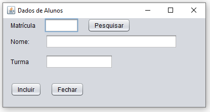
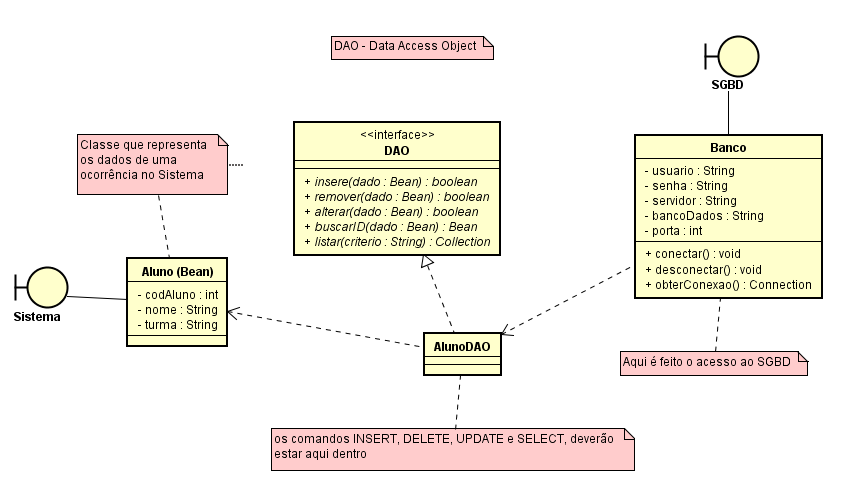

# projeto_matricula

Nesse sistema de matrícula, o administrador consegue pesquisar e incluir alunos através de um banco de dados.

Foi utilizado o paradigma de orientação a objetos e Jframes para a parte visual.
O projeto seguiu o padrão de arquitetura MVC.

